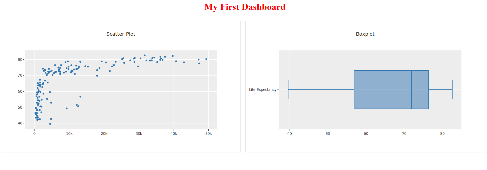
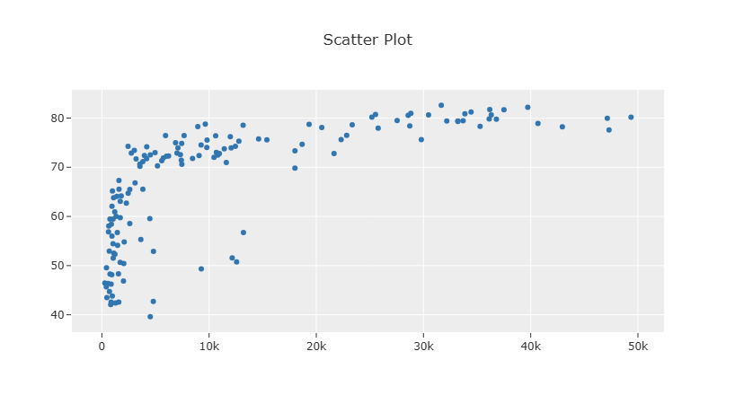
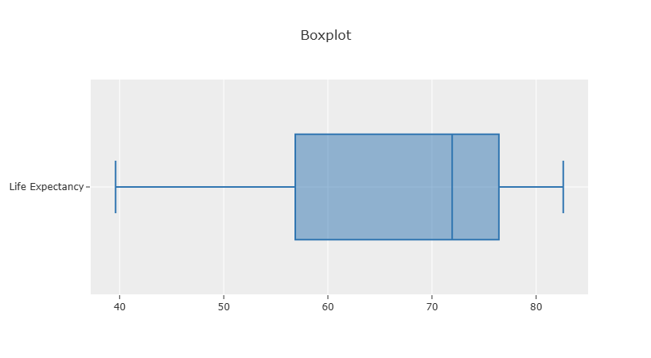

# 📊 Interactive Data Visualization Dashboard (Dash + Plotly)

A **web-based interactive dashboard** built using **Dash and Plotly** to explore **global development data (Gapminder dataset)**.

This project demonstrates **data visualization fundamentals**, **dashboard layout design**, and **analytical thinking**, forming a strong foundation for building **ML-powered data applications**.

---

## 🚀 Features

- 📈 **Scatter Plot (GDP vs Life Expectancy)**
- 📦 **Box Plot (Life Expectancy Distribution)**
- 🧠 **Clean and structured UI layout**
- ⚡ **Fast and lightweight Dash application**
- 📊 **Comparative visualization in single view**
- 🧩 **Simple and extendable architecture**

---

## 🧠 What This Project Demonstrates

This project highlights the following **data visualization and system design skills**:

- **Dashboard development using Dash**
- **Interactive visualization using Plotly**
- **UI layout design with Dash HTML components**
- **Data handling using Pandas**
- **Understanding relationships between economic and health indicators**
- **Building foundation for ML-powered dashboards**

---

## 📂 Project Structure

```
DASH_APP/
│
├── dashboard.py        # Main Dash application
├── gapminder.csv       # Dataset
├── requirements.txt    # Dependencies
├── README.md           # Project documentation
├── .gitignore
└── .venv/              # Virtual environment (ignored)
```

---

## ⚙️ Architecture Overview

The project follows a **simple dashboard architecture**.

```
Dataset (gapminder.csv)
        │
        ▼
Data Processing (Pandas)
        │
        ▼
Visualization Layer (Plotly)
        │
        ▼
Dash Application (dashboard.py)
        │
        ▼
Web UI (Browser)
```

### Design Principles

- **Separation of data processing and visualization**
- **Lightweight single-page dashboard**
- **Reusable visualization components**
- **Clear UI structure for analysis**

---

## 📊 Key Visualizations

### 1️⃣ Scatter Plot

- X-axis → GDP per capita  
- Y-axis → Life expectancy  
- Reveals **relationship between economic development and health outcomes**

---

### 2️⃣ Box Plot

- Displays **distribution of life expectancy**
- Highlights:
  - Median
  - Quartiles
  - Spread of data  

---

### 3️⃣ Layout Design

- Side-by-side graph layout  
- Clean separation using borders  
- Responsive UI using Dash components  

---

## 🖼️ Dashboard Preview

### 🔹 Full Dashboard View


---

### 🔹 Scatter Plot


---

### 🔹 Boxplot


---

## 🛠 Installation

### Clone repository

```bash
git clone https://github.com/your-username/DASH_APP.git
cd DASH_APP
```

### Create virtual environment

```bash
python -m venv .venv
```

### Activate environment (Windows)

```bash
.venv\Scripts\activate
```

### Install dependencies

```bash
pip install -r requirements.txt
```

---

## ▶️ Running the Application

Run the Dash app:

```bash
python dashboard.py
```

Open in browser:

```
http://127.0.0.1:8050/
```

---

## 📈 Potential Improvements

Future enhancements could include:

- Add **interactive filters (year, continent)**
- Implement **Dash callbacks for dynamic updates**
- Modularize project into **components + services**
- Integrate **ML models (prediction overlays)**
- Deploy on **cloud platforms (AWS / Render / Railway)**
- Add **real-time data integration**

---

## 🧰 Tech Stack

| Technology | Purpose |
|-----------|--------|
| Python | Programming language |
| Dash | Web dashboard framework |
| Plotly | Interactive visualization |
| Pandas | Data processing |
| Flask | Backend (via Dash) |

---

## 🎯 Learning Outcomes

This project helped build understanding of:

- **Dashboard development using Dash**
- **Interactive visualization techniques**
- **UI structuring for analytical applications**
- **Data relationship analysis**
- **Foundation for ML-integrated dashboards**

---

## 👤 Author

**Rudra Tyagi**

B.Tech Final Year Student  
Aspiring **ML Systems / MLOps / AI Infrastructure Engineer**